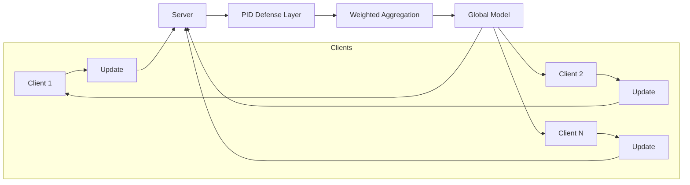

# Empirical Robustness Evaluation of Federated Learning under Poisoning Attacks

Controlled FL robustness testbed on MNIST using Flower + PyTorch. Supports FedAvg / TrimmedMean / Multi-Krum aggregation, deterministic sign-flip attack, PID-inspired exclusion defense, and IID vs non-IID (Dirichlet) partitioning. All runs are reproducible and write scoped artifacts under `experiments/results/<run_id>/`.

The focus is on understanding system behavior and failure modes under realistic assumptions — not on proposing new algorithms or achieving state-of-the-art accuracy.

---

## Module Layout

```
framework/
  aggregators.py   — fedavg, trimmed_mean, multi_krum (pure NumPy)
  attack.py        — select_malicious_client_ids, apply_signflip_attack
  defense.py       — cosine_direction_error, update_pid_score, select_top_k_by_score
  client.py        — Flower MnistClient
  strategy.py      — RobustFedStrategy (aggregation dispatch + PID exclusion)
data/
  partition.py     — IID and Dirichlet partitioning
  mnist.py         — MNIST loading + PartitionBundle dataclass
model/
  mlp.py           — MLP model + training/eval helpers
experiments/
  methods/fedavg.py — slim entry point: wires modules, writes debug CSVs
  runner.py         — experiment dispatch
  run_fedavg.py     — CLI entrypoint
  run_smoke.py      — fast synthetic smoke run (used by CI)
cfg/
  project.yaml     — all config defaults
  load_config.py   — path resolution and validation
```

---

## Quickstart

Install dependencies:

```bash
pip install -r requirements.txt
```

### Smoke run (fast, no real FL)

```bash
PYTHONPATH=. python experiments/run_smoke.py --run-id smoke-local --clean
```

### FedAvg (Flower + PyTorch)

```bash
PYTHONPATH=. python experiments/run_fedavg.py --run-id fedavg-local --clean
```

Aggregator variants:

```bash
PYTHONPATH=. python experiments/run_fedavg.py --run-id fedavg-trim --clean --aggregator trimmed_mean
PYTHONPATH=. python experiments/run_fedavg.py --run-id fedavg-krum --clean --aggregator multi_krum
```

Partition variants:

```bash
PYTHONPATH=. python experiments/run_fedavg.py --run-id iid-clean --clean --partition iid
PYTHONPATH=. python experiments/run_fedavg.py --run-id niid-clean --clean --partition dirichlet --alpha 0.1
```

Attack (sign-flip, off by default):

```bash
PYTHONPATH=. python experiments/run_fedavg.py --run-id atk-fedavg --clean --attack --malicious-fraction 0.25 --attack-scale 1.0
```

Attack + PID defense:

```bash
PYTHONPATH=. python experiments/run_fedavg.py --run-id pid-atk-fedavg --clean --attack --malicious-fraction 0.25 --defense --k-exclude 2 --kp 1.0 --ki 0.0 --kd 0.0
```

---

## Outputs

Each run writes under `experiments/results/<run_id>/`:

- `metrics.csv` — per-round: `round, client_fraction, train_loss, val_loss, val_acc, time_round_sec`
- `run_meta.yaml` — full config snapshot
- `agg_debug.csv`, `attack_debug.csv`, `defense_debug.csv`, `partition_debug.csv` — debug artifacts

Metrics format is documented in [experiments/metrics_schema.md](experiments/metrics_schema.md).

### Generate comparison plots

```bash
PYTHONPATH=. python experiments/plot_comparison.py
```

Produces `experiments/plots/comparison_val_acc.png` and `comparison_val_loss.png` — IID vs non-IID, clean / attack / attack+defense overlaid.

### Summarize all runs

```bash
PYTHONPATH=. python experiments/summarize_runs.py --minimal
```

Prints a compact ASCII table and writes `experiments/results/summary.csv`.

---

## Threat Model

- **Adversary:** A fixed subset of clients submits sign-flipped poisoned updates.
- **Server:** Aggregates updates and may apply PID-based anomaly detection.
- **Visibility:** The server observes only model updates, not client data.
- Attacks are non-adaptive; defenses operate solely on update statistics.

---

## Federated Learning Flow (with PID Defense)



---

## What This Project Demonstrates

- How poisoning attacks affect federated learning dynamics over rounds
- When anomaly-detection defenses help and when they fail
- Sensitivity to non-IID data and early-round instability
- The tradeoffs introduced by server-side filtering mechanisms
